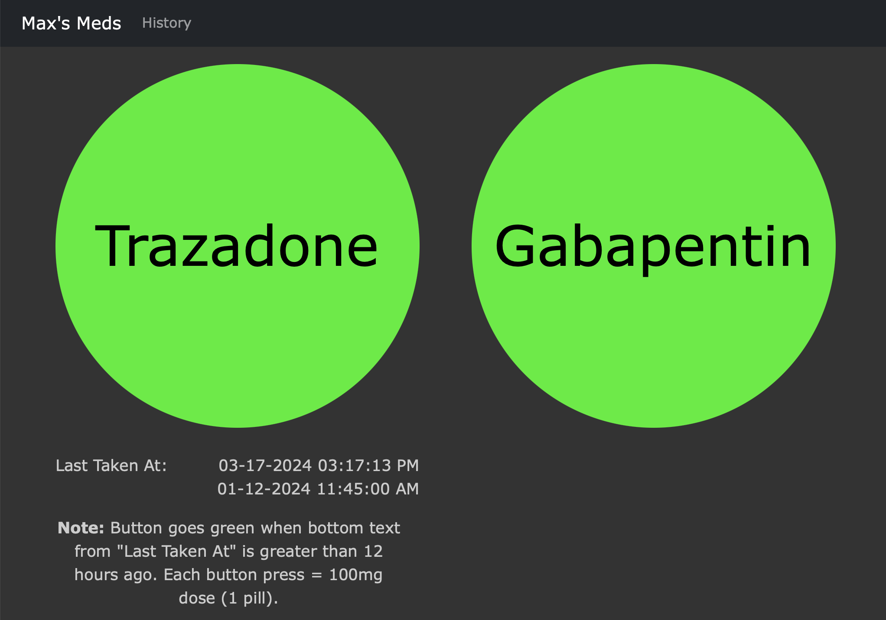
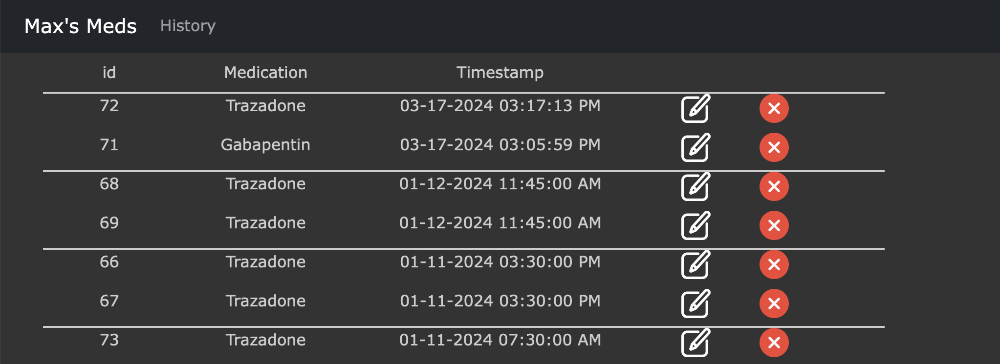

# MaxMeds
A web application designed to help make sure my dog (Max) is not given too many pills while he's still recovering from jumping out of a truck.

## Story
Basically, family went out to a beach in another state. While stuck in traffic, the window got rolled down too far in favor of the dog having a good time. The window did not get rolled back up once traffic started to ease up, and the dog jumped out of the moving truck while the vehicle was going about 50 mph.

## Application Images

## TODO

  
✅ Completed Tasks

  
  [✅] Add Trazadone button
  
  [✅] Add Gabapentin button
  
  [✅] Fetch data from RESTful API using JavaScript
  
  [✅] Send updates when either medication is given
  
  [✅] Combine everything into one runner file so raspberry pi can host independently
  
  [✅] Add /history page
  
  [✅] Add on board count for Trazadone
  
  [✅] Change Trazadone button color based on how many he has in his system currently (2 per 8-hour window)
  
  [✅] Change Gbapentin button color based on how many he has in his system currently (1 per 8-hour window)
  
  [✅] Add edit button

### Remaining Tasks
[ ] Add tests to make sure changes don't break anything
